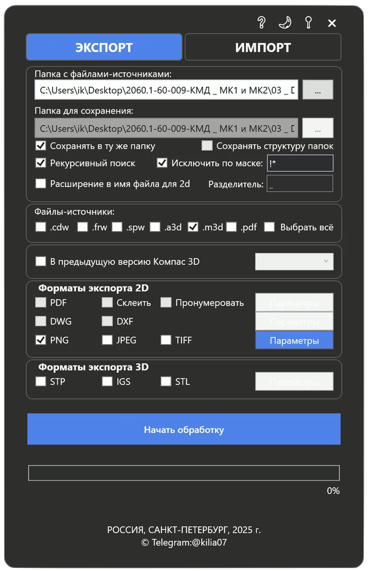
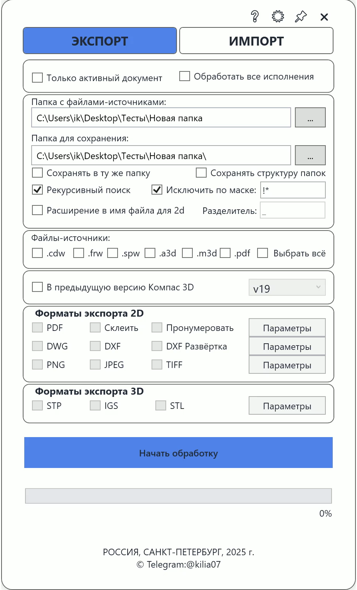

# Сохранятор

**Сохранятор** — вспомогательная утилита для **КОМПАС-3D**, предназначенная для **пакетной обработки файлов** различных форматов (M3D, A3D, CDW, SPW, FRW, PDF).

Позволяет массово экспортировать файлы в 2D и 3D форматы, сохранять проекты в более ранние версии КОМПАС, а также импортировать таблицы Excel. 

---

## 📤 Поддерживаемые форматы экспорта

### 🖼️ **2D форматы**
- **PDF** — с возможностью сквозной нумерации и склейки в единый файл
- **DWG, DXF**
- **PNG, JPEG, TIFF**

### 🧱 **3D форматы**
- **STP, IGS, STL**
- **PNG, JPEG, TIFF** — с поддержкой:
  - Выбора ориентации: *Изометрия*, *Спереди*
  - Скрытие СК и ЛСК
  - Автообрезка белого фона

---

## 🔁 Дополнительные возможности

- 📂 Сохранение проекта в предыдущие версии КОМПАС вплоть до **v19**
- 📑 Импорт таблиц **Excel** в КОМПАС-3D
- 🔎 Рекурсивный поиск по структуре проекта
- 🔥 Исключение файлов из обработки по маске
- 🌓 Поддержка **тёмной и светлой темы**
- 📌 Возможность **закрепления окна** поверх всех

---

## 🚀 Установка и запуск

1. Скачайте `.exe` файл из раздела [Releases]([https://github.com/yourusername/saveas/releases](https://github.com/kilia07/sohranyator/blob/main/Сохранятор.exe)).
2. Запустите файл. Установка не требуется (portable).

> ⚠️ Необходим установленный **КОМПАС-3D v19** или выше

---

## 🧑‍💻 Технические детали

- Язык: **C# / WPF (.NET)**
- Графический интерфейс: **XAML**
- Поддержка горячих клавиш и фона
- Поддержка тем оформления
- Взаимодействие с КОМПАС API

## 🖼 Скриншоты интерфейса

### 🌙 Тёмная тема

### ☀️ Светлая тема

---
## Скачать
[Releases]([https://github.com/yourusername/saveas/releases](https://github.com/kilia07/sohranyator/blob/main/Сохранятор.exe))

**Автор:** [@kilia07](https://github.com/kilia07)
